# Developer Guide

## Navigation

* [Acknowledgements](#acknowledgements)
* [Design and Implementation](#design--implementation)
    * [Parser](#parser)
    * [Storage](#storage)
    * [Semester](#semester)
    * [Module](#module)
    * [Schedule List](#schedulelist)
    * [Task list](#tasklist)
    * [Task](#task)
    * [Overall Task List](#overalltasklist)
    * [Overall Task](#overalltask)
* [Product Scope](#appendix-a-product-scope)
* [User Stories](#appendix-b-user-stories)
* [Non-Functional Requirements](#appendix-c-non-functional-requirements)
* [Glossary](#appendix-d-glossary)
* [Instructions for Manual Testing](#appendix-e-instructions-for-manual-testing)

## Acknowledgements

Third party libraries:

- [Jackson Databind](https://mvnrepository.com/artifact/com.fasterxml.jackson.core/jackson-databind)
- [Jackson Datatype-jsr310](https://mvnrepository.com/artifact/com.fasterxml.jackson.datatype/jackson-datatype-jsr310)
- [Jackson Annotations](https://mvnrepository.com/artifact/com.fasterxml.jackson.core/jackson-annotations)

# Design & Implementation

## Parser

**API** : <code>command.parser </code>

The Parser classes is responsible for receiving user input and converting it into commands which are directly passed to
respective classes.

The simplified class diagram below is an overview of relationship between Parser classes and other classes.

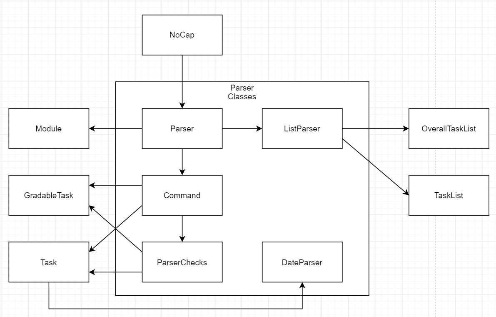

How the parsing works:

* `NoCap` passes the user input to `Parser` which separates the input into useful information such as taskType,
  taskDescription, Module, etc.
* When commands include **listing tasks**, the taskDescription is passed to `ListParser` which determines the method of
  sorting and creates filtered `OverallTaskList` and `TaskList` accordingly.
* Otherwise, the taskDescription is passed to `Command` which calls the corresponding commands in `SemesterList`,
  `Semester` ,`ModuleList`, `Module` , `Task`, `Gradable Task`. For clarity purposes, associations are shown but
  dependencies are not.
* `ParserChecks` is a class that handles various error checking and string searching methods such as
  `ParserSearch#getTaskFromIndex()` and `ParserSearch#getTaskFromKeyword()`. `Command` utilizes these methods to verify
  the Strings before passing them to other classes.
  *In NoCap, Parser verifies the validity of input (Whether it exists in the right format). Input content is verified by
  individual classes for correctness.*
* `DateParser` handles parsing String into LocalDateTime format and displaying LocalDateTime as String. It is utilized
  by `Task`. Additional date formats can be added in `DateParser#inputFormatter()`

Below is a step by step example of how the parser receives and decipher a user input. In this example, the user enters
`list task sortbydate`.

The Sequence Diagram below illustrates the process
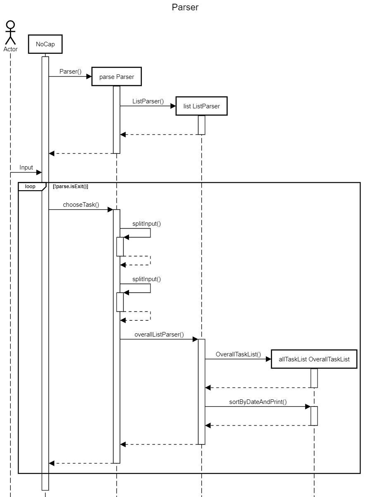  
**Note**: The alternate paths are omitted from the diagram for clarity.<br/><br/>

Step 1: The User launches the application. `NoCap` creates a new `Parser` instance through the constructor and `Parser`
creates `ListParser`.<br/><br/>

Step 2: The application waits for User input. User enters `list task sortbydate`. `NoCap` passes the input to `Parser`
through `Parser#chooseTask()`.<br/><br/>

Step 3: `splitInput` is called for the first time and splits the user input into `list` and `task sortbydate`.
> **TaskType** is set to `list`, and **TaskDescription** is set to `task sortbydate`.

**TaskType** matches a possible command String.
<br/><br/>

Step 4: `splitInput` is called for the second time and splits the user input into `task` and `sortbydate`.
> **TaskType** is set to `task`, and **TaskDescription** is set to `sortbydate`.

**TaskType** and **TaskDescription** are passed to `ListParser` through `ListParser#overallListParser`.
<br/><br/>

Step 5: `overallListParser` creates an `OverallTaskList`. Through nested switch cases, **TaskType** and **TaskDescription** are matched, and the corresponding method `OverallTaskList#sortByDateAndPrint()` is called. As the
name implies, this method sorts all tasks by date and prints them.
> If **TaskType** does not match, then an error message is displayed.  
> If **TaskDescription** does not match, all tasks are printed by default.


<br/><br/>
Step 6: The full command is carried out and the application returns to NoCap and waits for new User Input.<br/><br/>

The diagram below illustrates the `splitString` process:

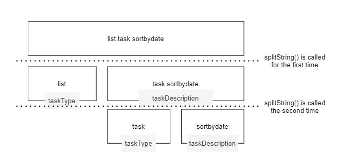
<br/><br/>

## Storage

**API** : `command.storage`

The Storage component saves data of NoCap into JSON format, and reads them back into corresponding objects when needed
using a 3rd party library Jackson Databind.

It consists of 2 utility classes StorageDecoder and StorageEncoder. StorageEncoder is used to encode the parent object
`SemesterList` into a JSON file. StorageDecoder decodes a JSON file into a `SemesterList `object

How the `StorageEncoder` class works:

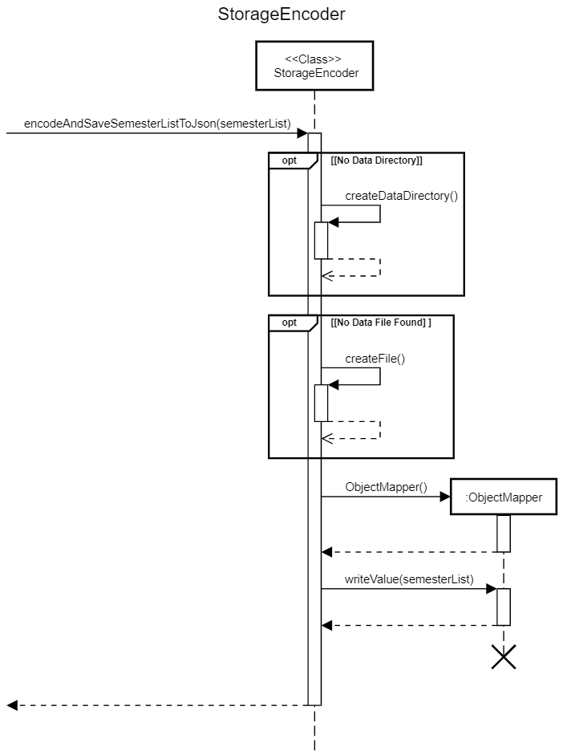

1. The static method `encodeAndSaveSemesterListToJson()` from `StorageEncoder` is called when NoCap data needs to be
   saved
2. If the save file directory has not been created yet, it is first created in order to store the save file
3. Similarly, an empty file is created to store the data if it has not been created yet
4. Then, the object `SemesterList` is  converted into a JSON file with an `ObjectMapper`
   object from the  `jackson-databind` library
5. Upon completion, the data file is saved in a default data directory.

How the `StorageDecoder` class works:

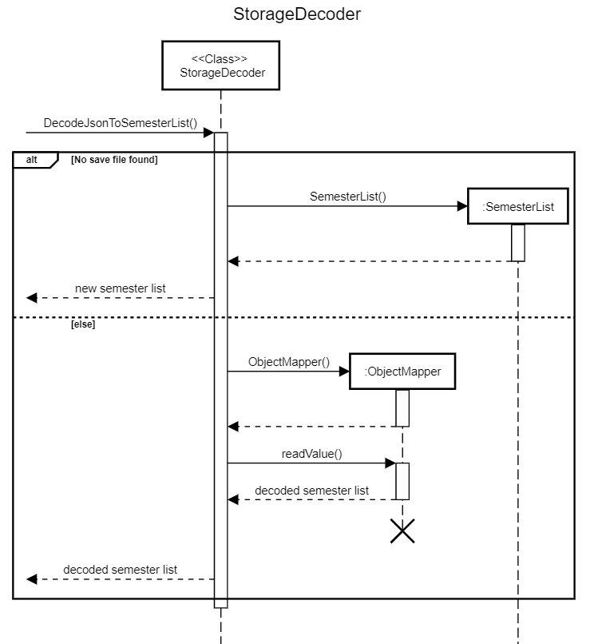

1. The static method `decodeJsonToSemesterList()` from `StorageDecoder` is called when NoCap data needs to be loaded
   from the save file
2. If there is no save file available in the default data directory, a new `SemesterList `object is created and returned
   to the caller
3. Otherwise, an `ObjectMapper` object from the  `jackson-databind` library is used to deserialize the JSON save file
   into a `SemesterList` object to be returned to the caller
   <br/><br/>

## Semester

**API** : `semester`


The `Semester` component stores all NoCap data i.e., all `Semester` objects and their components and cumulative average
point (CAP) (which are contained in a SemesterList object)

* It consists of 2 classes `SemesterList` and `Semester`
* `SemesterList` is used to compute and store the cumulative CAP of all semesters and also stores 10 `Semester` objects
* Each `Semester` object stores and computes the individual CAP for the semester, while also storing a `ModuleList` of
  the `Module` objects taken during the semester
* The computation of the CAP for both `SemesterList` and `Semester` is automatically done when a grade/credit as added
  to a `Module` object within any semester

This is how CAP is computed:


* When `commandAddGrade()` or `commandAddCredit()` is called in Parser, `addGrade(description)`
  or `addCredit(description)` respectively are called in `Module`, setting the module’s `grade`, `points` and `credits`
  to their corresponding values.
* Then, `updateCap()` is called in `Semester` with the newly set `grade`/`credits` values in `Module`, followed
  by `updateCap()` in `SemesterList` with the newly set `points`/`credits` values in `Semester`.
  <br/><br/>

## Module

**API** : `module`

All data related to module is stored in the module class. An Arraylist of Module is used to store and manage the
modules. ModuleList is also responsible for constructing and printing out the Timetable.

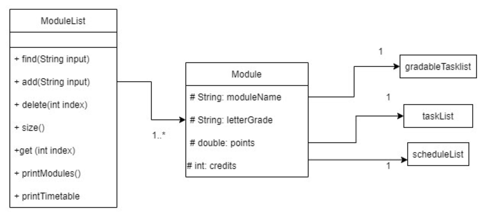

The modules are stored in an ArrayList and ModuleList uses the Module.get(int index) method to access the target Module.

- ModuleList is responsible for printing the Time Table.
- ModuleList contains the getter method find(String input) which returns a module by the same name as the input.
- Module contains getter and setter methods to change or access its contents.
- When Module is constructed, an empty gradableTaskList, taskList and scheduleList wll be instantiated and stored in
  Module.

Data stored in Module includes:

1. moduleName
2. letterGrade
3. credits
4. points
5. TaskList
6. GradableTaskList
7. ScheduleList

The modules are stored in an ArrayList and ModuleList uses the Module.get(int index) method to access the target Module.

- ModuleList is responsible for printing the Time Table. It accesses different schedules of different mods before
  constructing a Time Table.
- ModuleList contains getter method find(String input) which returns a module by the same name as the input.

How printing a timetable works:

1. ModuleList first extracts day of week and timeslot information from different schedules.
2. It then prints out the Timetable one line at a time. At the same time it checks if the day of week and the timeslot
   corresponds to the schedule.

- If day of week and timeslot corresponds, venue and comments information is printed out
- If day of week and timeslot does not correspond, and blank character &quot; &quot; is printed instead.

# 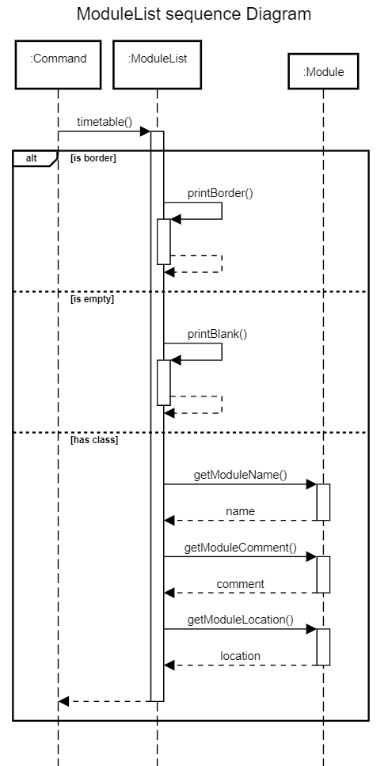

How printing a timetable works:

1. When Timetable is called, ModuleList goes into a loop to print out the timetable. ModuleList iterates through the 207
   character long length and the 33 lines which makes up the entire timetable.
2. Each iteration of the loop can result in 1 of 3 cases:
1. It is at a border. When this happens a &quot;#&quot; character is printed to the console which denotes a border.
2. It is empty. When this happens a &quot; &quot;(blank) character is printed to the console.
3. It contains module information. When this happens, getMoudleName() , getModuleLocation() and getModuleComment() is
   called. The information is then printed onto the console.
   <br/><br/>

## ScheduleList

**API** : `schedule`

ScheduleList consists of all data for the schedule for the module.

This includes:

1. `day`
2. `location`
3. `startTime`
4. `comments`

How ScheduleList works:

1. An empty `ScheduleList` is created when a module is constructed.
2. When `addClass` is called in `module` , `ScheduleList` parses the input from the user and splits the information into
   the relevant information. The information is then used to generate a new instance of `Schedule` which is then added
   to the list.

Notes about ScheduleList

- ScheduleList checks that the input for the day of the week is only from the list of possible days: `MON`, `TUE`, `WED`
  , `THU`,
  `FRI`, `SAT` ,`SUN`. All other inputs will result in an exception being thrown.
- When a new `Schedule` class is called, `ScheduleList` ensures that the length of venue and comments are less than 16
  characters in length. This is to ensure that it fits within its time slot within the Timetable when printed.

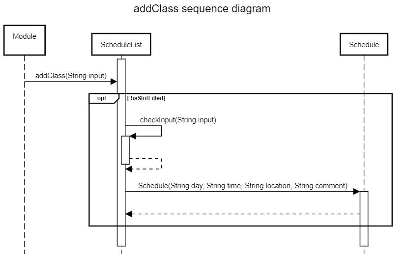

Adding Schedule to scheduleList

- When addclass() is called, schedule first checks if there is a duplicate schedule currently in the list. This is done
  by going through the whole list and checking if a schedule has the same time slot. If there exists a schedule in the
  same time slot, an error message is printed.
- If it is an empty timeslot, schedule list parses the input and checks for formatting errors within the input.
- A new instance of Schedule is generated and added to the schedule list.
  <br/><br/>

## TaskList

**API** : `task.tasklist`

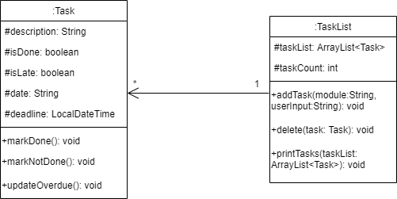

How the `TaskList` component works:

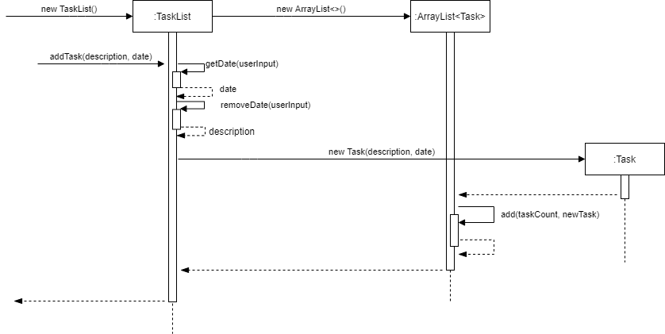

1. `TaskList` stores all tasks in an `ArrayList<Task>`.
2. When the `addTask()` method is called, the method `getDate()` will return the `date` string from the user input
3. The method `removeDate()` will return the `description` string from the user input by removing the date component in
   the user input.
4. Then store it as a local variable of a `String` type.
5. The `String` variables will then be passed to instantialize a new `Task` object.
6. This `Task` object will then be stored in the `ArrayList` in the `TaskList` object.
7. The methods `weeklyTaskList()`, `monthlyTaskList()` and `yearlyTaskList()` returns an `ArrayList` which contains
   the `Task` objects of deadline within a week, a month and a year respectively.
8. The methods `sortTaskListByDate()`  and `sortTaskListByStatus()` will sort the current `TaskList` object by ascending
   order of `Deadline` and completion status respectively
9. The `ArrayList` returned by the above methods can then be passed to `printTasks()` which will call `toString()` in
   each `Task` object and print to the `Output Stream`.
   <br/><br/>

## Task

**API** : `task.task`

`Task` object stores the following for each task:

1. `description`
2. `date`
3. `isDone`
4. `isLate`
5. `deadline`

How the `Task` component works:

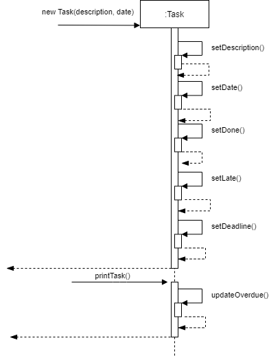

1. Whenever the `Task` object is instantiated, the `attributes` listed above will be initialized by the `setter`
   methods: `setDescription()`,  `setDate()`,  `setDone()`, `setLate()` and `setDeadline()`.
2. When calling `printAllTask()`, `printWeeklyTask()`, `printMonthlyTask()` in `OverallTaskList` the
   method  `updateOverdue()`will be called which checks for the truth value of the `boolean` attribute `isDone` and also
   whether the current date and time of the system clock is after the `deadline` of the `Task` object.
3. If `isDone` is `FALSE` and the `deadline` is later than the current date and time, `updateOverdue()` will set the
   attribute `isLate` of the current `Task` object to `TRUE`.
4. Calling the toString converts the task information in the Task object to printable String.

Note:

* The printTask() call in the sequence diagram is a generalised method from: `OverallTaskList#addAllNormalTasks()`
  , `OverallTaskList#addAllGradableTasks()` and `TaskList#printTasks()`
* Any call from the methods above will result in the following sequence in the sequence diagram.
  <br/><br/>

## OverallTaskList

**API** : `task.OverallTasklist`

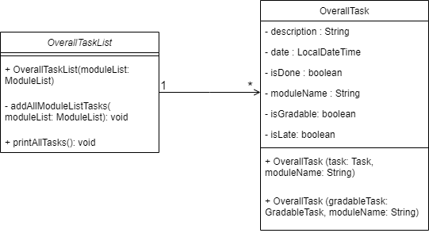

_Class diagram for OverallTask and OverallTaskList_

**Note**: Some methods are omitted from the class diagram to improve clarity

The `OverallTaskList` class is instantiated from `ListParser` only when the end user needs to list available tasks in
a `Semester`.

How the `OverallTaskList` class works:

1. `OverallTask` objects (explained further under `OverallTask`) are stored in an ArrayList `overallTaskList.`
2. Both `Task` and `GradableTask` objects are converted to `OverallTask` objects first before being inserted into
   `OverallTaskList`.
3. When the `OverallTaskList` object is instantiated, a `ModuleList` object from a semester is passed to its
   constructor.


   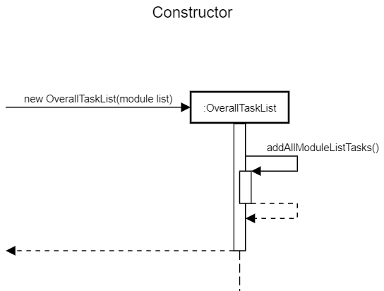
4. The constructor calls the method `addAllModuleListTasks(module list)` which converts and adds all the tasks in the
   module list into `OverallTaskList`.
5. Once the object is instantiated, the following methods can be called to sort and print the tasks in the
   ArrayList `overallTaskList`. All sorting and filtering is done via `Java Streams`, and method details are omitted.

   * `sortByDateAndPrint() - Print all tasks sorted by deadline`
   * `sortByStatusAndPrint() - Print all tasks sorted by status(done)`
   * `printWeeklyTasks() - Print tasks due in a week`
   * `printMonthlyTasks() - Print tasks due in a month`
   * `printYearlyTasks() - Print tasks due in a year`
   * `printAllTasks() - Print all tasks without sorting`
   * `printGradableTasks() - Print all gradable tasks`
   * `printNormalTasks() - Print all non-gradable tasks`

Notes about `OverallTaskList`

* Once `ListParser` is done using the object, it is deleted and the task list is not stored anywhere. The reason for
  this is to reduce coupling between objects and remove the need to update separate task lists whenever tasks are added
  to `Modules`.
  <br/><br/>

## OverallTask

**API** : `task.OverallTask`

`OverallTask` objects are stored in a `OverallTaskList` object when the end user needs to list available tasks in
a `Semester`. It stores information from `GradableTask/Task `objects together with their module name.

`OverallTask` object stores the following for each task:

1. `description`
2. `Date`
3. `isDone`
4. `isLate`
5. `Deadline`
6. `isGradable`
7. `Weightage`
8. `moduleName`

How the `OverallTask` component works:

1. It inherits from `Task`, with additional attributes `isGradable`, `weightage` and `moduleName`.
2. The attributes `isGradable`, `weightage` are added to provide more information for gradable tasks, while `moduleName`
   is added to display module information.
3. It can be instantiated with 2 different constructors:
    * `OverallTask(task: Task, moduleName: String)` - Instantiates using a `Task` object <br/>
      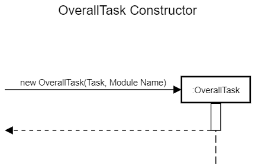
    * `OverallTask(gradableTask:GradableTask, moduleName: String)` - Instantiates using a `GradableTask `object <br>
      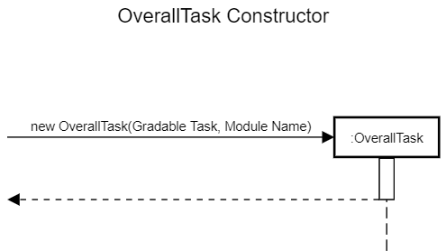

4. During instantiation, information from `Task/GradableTask` objects are added to the `OverallTask` object together
   with their `moduleName` .
5. Calling the `toString()` method generates a string containing task information together with its `moduleName`.
   <br/><br/>

# Appendix A: Product Scope

**Target User Profile:**

* NUS student
* is reasonably comfortable using CLI apps
* can type fast
* prefers typing to mouse interactions
* prefer desktop apps over other types

**Value Proposition:**

A centralized platform which allows NUS Students to carry out their learning management without needing to frequently
switch between multiple tools or applications such as NUSMods, Luminus, Sticky Notes etc.
<br/><br/>

# Appendix B: User Stories

|Version| As a ... | I want to ... | So that I can ...|
|--------|----------|---------------|------------------|
|v1.0|Forgetful student|have an app to automatically list out my deadlines for each week|prioritise my work.|
|v1.0|Busy student|be reminded of my tasks|remember all my tasks.|
|v1.0|Student|see which assignments are completed and which are not|know my progress in this module.|
|v1.0|User|visualize my timetable|reference it easily.|
|v1.0|User of a to-do app|see the deadline of each task|prioritise my work.| 
|v2.0|Student|be able to update module details|update outdated information.|
|v2.0|Student|easily track my CAP progression|  gauge how well I am doing.|
|v2.0|Student|have quick access to upcoming gradable assignments|be sure everything is prepared for.|
|v2.0|Student|be able to know what classes i have up next|  prepare for them in time.|
|v2.1|University student| see the weightage of the modules| place emphasis/focus on certain work when there is a lack of time.|

<br/><br/>

# Appendix C: Non Functional Requirements

1. Should work on any mainstream OS as long as it has Java 11 or above installed.
2. A user with above average typing speed for regular English text (i.e. not code, not system admin commands) should be
   able to accomplish most of the tasks faster using commands than using the mouse.
   <br/><br/>

# Appendix D: Glossary

* **Command Line Interface(CLI)** - A command-line interface (CLI) processes commands to a computer program in the form
  of lines of text(From [Wikipedia](https://en.wikipedia.org/wiki/Command-line_interface)).
* **Mainstream Operating Systems(OS)** - Windows, Linux, Unix, OS-X
* **Visualise** - Snapshot of the graded components which the module is made up of and their individual percentages.
<br/><br/>

# Appendix E: Instructions for Manual Testing

Given below are instructions to test the app manually.

**Note:** These instructions only provide a starting point for testers to work on, testers are expected to do more
exploratory testing.

## Launch

1. Initial launch
    1. Download the JAR file and copy it into an empty folder
    2. Open up your terminal, and navigate to the folder containing the JAR file
    3. Type the following command:
   ```
   java -jar NoCap.jar
   ```
   **Note**: It is important that you navigate to the directory containing the JAR file first before running the
   application, as it may affect the location of the save file.

## Saving/Loading data

1. Automatic saving
    1. Carry out any command that adds/modifies data in the application, e.g `add CS2102`, or simply exit the
       application using the command `bye`.
    2. Expected: A JSON file is created/updated automatically in the data folder located in folder containing the JAR
       file, provided the instructions in `Launch` is followed correctly.
2. No save file exists
    1. Prerequisites: Make sure the data folder does not exist/is deleted from the folder containing the JAR file.
    2. Run the application as stated in `Launch`
    3. Expected: Application starts with an empty template and shows the following message:
       ```
       No save file found, starting with an empty template
       Welcome to NoCap
       ```
3. Save file exists
    1. Prerequisites: Make sure that a save file already exists in the data folder that is located in the folder
       containing the JAR file. If not, simply carry out any command that adds/modifies data in the application,
       e.g `add CS2102`(see 1. Automatic Saving), and the save file will be created automatically.
    2. Run the application as stated in `Launch`
    3. Expected: Application loads the save file when starting the application and shows the following message:
   ```
   Data loaded successfully
   Welcome to NoCap
   ```
4. Corrupted save file
    1. Prerequisites: Make sure that a save file already exists in the data folder that is located in the folder
       containing the JAR file If not, simply carry out any command that adds/modifies data in the application,
       e.g `add CS2102`(see 1. Automatic Saving), and the save file will be created automatically.
    2. To simulate data corruption, remove lines to cause syntax errors in the JSON file, such as lines containing `{` and `}`.
    3. Run the application
    4. Expected: An error message is shown and application starts with an empty template, showing the message below:
   ```
   Error reading save file, creating new template
   Welcome to NoCap
   ```

## Listing semesters

1. Run the command `list semesters`
2. Expected: 10 pre-loaded semesters from Y1S1 to Y5S2 presented in the following message:
    ```
    1 : Y1S1
    2 : Y1S2
    3 : Y2S1
    4 : Y2S2
    5 : Y3S1
    6 : Y3S2
    7 : Y4S1
    8 : Y4S2
    9 : Y5S1
    10 : Y5S2
    ```

## Switching semesters

1. On first use, NoCap defaults to Y1S1 semester
2. On subsequent launches, NoCap defaults to the last accessed semester
3. Switching between semesters
    1. Choose a semester index from 1-10 with reference to `list semesters`
    2. Run the command `switch <index>` to switch to the new semester
    3. For example, if '3' is chosen, running `switch 3` gives the following expected message:
       ```
       Semester successfully switched
       You are now accessing semester: Y2S1
       ```

## Adding a module to a semester

1. Prerequisite: Module should already exist.
2. Adding a module that does not exist.
    1. Run the command: `add CS2040C`
    2. Expected:
   ```
   Module successfully added: 
   1
    Module name: CS2040C
    CREDITS: 0
    --------------------------- 
    SCHEDULE:
    --------------------------- 
    GRADE: NIL
    TASKS: []
    BREAKDOWN:
   ```
3. Adding a module that already exists.
    1. Prerequisite: module with the same name exists in current semester list. e.g. CS2040C
    2. Run the command `add CS2040C`
    3. Expected:`This module already exists!`

4. Adding a module that is longer than 16 Characters.

   Expected: `Module name must be less than 17 characters`

## Deleting a module from a semester

1. Prerequisite: Module index should already exist in the ModuleList
2. Deleting a module with a valid index.
    1. Run the command: `delete 1`
    2. Expected:
   ```
    CS2040C has been successfully deleted
    Remaining Modules are:
   ```
3. Deleting a module with an invalid index
    1. Run the command: `delete 999`
    2. Expected
   ```
    Invalid number value
   ```   

## Listing all modules in a semester

1. Prerequisite: Semester should exist.
2. Run the command: `list module`
3. Expected:
    ```
    1
    Module name: CS2113T
    CREDITS: 4
    --------------------------- 
    SCHEDULE: 
    --------------------------- 
    GRADE: B+
    TASKS: []
    BREAKDOWN: 
    
    2
    Module name: CS1010
    CREDITS: 0
    --------------------------- 
    SCHEDULE: 
    --------------------------- 
    GRADE: NIL
    TASKS: []
    BREAKDOWN: 
    ```

## List tasks in a semester

1. List tasks when there are no available tasks
    1. Prerequisites: There should be no tasks added to modules in the current semester yet.
    2. Run the command `list task`
    3. Expected: No tasks are shown and the following message is shown:
       ```
       All tasks: 
       You have no tasks
       ```
2. List tasks with optional arguments
    1. Prerequisites: There should be tasks added to modules in the semester beforehand. Can be checked by
       running `list task`. If there are no tasks in the semester, add in tasks first(including both gradable and
       non-gradable tasks)
    2. Run list task command with optional arguments, as specified in the user guide, e.g. `list task gradable`
    3. Expected: Tasks are shown accordingly, depending on the optional argument

## Adding a task to a module

1. Prerequisite: Module CS1010 already exists.
2. Adding a valid Task to CS1010.
    1. Run the command: `/m cs1010 addtask as01 /by 11/12/2021 2359`
    2. Expected:
   ```
    Added new task to CS1010
    [ ] as01 by: 11 Dec 2021 11:59 PM
   ```
3. Adding a Task with an invalid syntax.
    1. Run the command : `/m cs1010 addtask as01 /by 11-12-21 2359`
    2. Expected:
    ```
    Wrong date format input!
    Format: dd/MM/yyyy hhmm
    ```
    3. Run the command: `/m cs1010 addtask /by 11/12/2021 2359`
    4. Expected:
    ```
    You are missing a description!
    ```

## Adding a GradableTask to module

1. Prerequisite: Module CS2040C should already exist.
2. Adding a valid GradableTask to module.
    1. Run the command: `/m cs2040c addgradable finals /by 11/11/2021 1000 /w 50`
    2. Expected:  
    ```
     Added new task to CS2040C
    finals by: 11 Nov 2021 10:00 AM Weightage 50% [ ]
    BREAKDOWN:
    <======================50%=======================>
    ##################################################
    |-----------------------1------------------------|
    1: finals
    
    1 finals by: 11 Nov 2021 10:00 AM Weightage 50% [ ]
    ```
3. Adding a GradableTask with an invalid syntax.
    1. Run the command : `/m cs2040c addgradable finals /by 00/00/00 /w 50`
    2. Expected:
    ```
    Wrong date format input!
    Format: dd/MM/yyyy hhmm
    BREAKDOWN:
    ```

## Listing all gradable tasks

1. Prerequisite: module CS2040C should already exist.
2. Run the command: `/m cs2040c addgradable finals /by 11/11/2021 1000 /w 50`
3. Run the command: `/m cs2040c addgradable midterms /by 11/09/2021 1300 /w 50`
4. Run the command: `/m CS2040C list gradable`
5. Expected:
    ```
   BREAKDOWN:
    <======================50%=======================><======================50%=======================>
    ##################################################@@@@@@@@@@@@@@@@@@@@@@@@@@@@@@@@@@@@@@@@@@@@@@@@@@
    |-----------------------1------------------------||-----------------------2------------------------|
    1: finals
    2: midterms

    1 finals by: 11 Nov 2021 10:00 AM Weightage 50% [ ]
    2 midterms by: 11 Sep 2021 01:00 PM Weightage 50% [ ]
    ``` 

## Editing a task

1. Prerequisites: module CS2040C exists without any existing task.
2. Add a new task: `/m cs2040c addtask testcase 1 /by 11/11/2021 0000`.
3. Editing description:
    1. Run the command: `/m cs2040c editdesc 1 testcase 2`.
    2. Run the command: `/m cs2040c list`.
    3. Expected:
    ```
    Task List for CS2040C:
    There are 1 tasks
    1.[ ] testcase 2 by: 11 Nov 2021 12:00 AM
    ```
4. Editing deadline:
    1. Run the command: `/m cs2040c editdate 1 12/12/2022 1212`.
    2. Run the command: `/m cs2040c list`.
    3. Expected:
    ```
    Task List for CS2040C:
    There are 1 tasks
    1.[ ] testcase 2 by: 12 Dec 2022 12:12 PM
    ```

## Deleting a task

1. Prerequisites: module CS2040C exists without any existing task.
2. Add a new task: `/m cs2040c addtask testcase 1 /by 11/11/2021 0000`.
3. Deleting a task without matching keyword:
    1. Run the command: `/m cs2040c deletetask apple`.
    2. Expected: `Task with the specified keyword not found!`
4. Deleting a task with the matching keyword:
    1. Run the command: `/m cs2040c deletetask test`.
    2. Expected:
    ```
    The following task(s) are found:
    1: testcase 2
    Please choose a task to perform the action, or press x to cancel:
    ```
    3. Enter input: `1`.
    4. Expected: `testcase 1 has been deleted`.

## Marking a task as complete

1. Prerequisites: module CS2040C exists without any existing task.
2. Add a new task: `/m cs2040c addtask testcase 1 /by 11/11/2021 0000`.
3. Run the command: `/m cs2040c done 1`.
4. Expected:
    ```
    Task is completed:
    [X] testcase 1 by: 11 Nov 2021 12:00 AM
    ```

## Listing all tasks in a module

1. Prerequisites: module CS2040C exists without any existing task.
2. Add a new task: `/m cs2040c addtask testcase 1 /by 11/11/2021 0000`.
3. Add a new task: `/m cs2040c addtask testcase 2 /by 12/12/2022 1212`.
4. Run the command: `/m cs2040c list`.
5. Expected:
    ```
    Task List for CS2040C:
    There are 2 tasks
    1.[ ] testcase 1 by: 11 Nov 2021 12:00 AM
    2.[ ] testcase 2 by: 12 Dec 2022 12:12 PM
    ```

## Adding a grade to a module

1. Prerequisites: module CS2040C exists without any task/class/credit.
2. Run the command: `/m cs2040c addgrade A`
3. Expected:
    ```
    Module grade successfully added: 
    Module name: CS2040C
    CREDITS: 0
    --------------------------- 
    SCHEDULE: 
    --------------------------- 
    GRADE: A
    TASKS: []
    BREAKDOWN: 
    ```

## Deleting a grade from a module

1. Prerequisites: module CS2040C exists and has an assigned grade.
2. Run the command: `/m cs2040c deletegrade`.
3. Expected: `Module grade has been successfully deleted`.

## Adding a credit to module

1. Prerequisites: module CS2040C exists without any task/class/grade.
2. Run the command: `/m cs2040c addcredit 4`
3. Expected:
    ```
    Module credits successfully added: 
    Module name: CS2040C
    CREDITS: 4
    --------------------------- 
    SCHEDULE: 
    --------------------------- 
    GRADE: NIL
    TASKS: []
    BREAKDOWN: 
    ```

## Adding a class to module

1. Prerequisite: module CS2040C exists.
2. Adding a class with valid syntax.
    1. Run the command: `/m CS2040C addclass MON/1000/ZOOM/LECT`
    2. Expected:
    ```
    Module Class successfully added: 
    1.
    Day: MON
    Start Time: 1000
    Location: ZOOM
    Comments: LECT
    ```
5. Adding a class that occupies the same timeslot.
    1. Run the command: `/m CS2040C addclass MON/1000/ZOOM/TUT`
    2. Expected: `A class already exists in this timeslot!`

## Delete class from a module

1. Select an existing class index with reference to the command `/m <module> info`.
2. Run the command `/m <module> deleteclass <index>`.
3. Expected: Corresponding class is deleted from module schedule.

## Show timetable

1. Run the command `timetable`
2. Expected: Prints out a timetable of all classes from 0800 to 1700 periods

## Show semester cap

1. Run the command `cap`
2. If no credit is added for any module in the semester, expected:
    ```
    Unable to calculate cap as no credit assigned to any existing module
    ```
3. Else, the cap is calculated accordingly and printed.

## Show all cap

1. Run the command `allcap`
2. Expected: prints out the aggregate cumulative CAP and respective CAP of each semester
3. Semesters with no credit assigned for any module will default to 0.00 CAP
