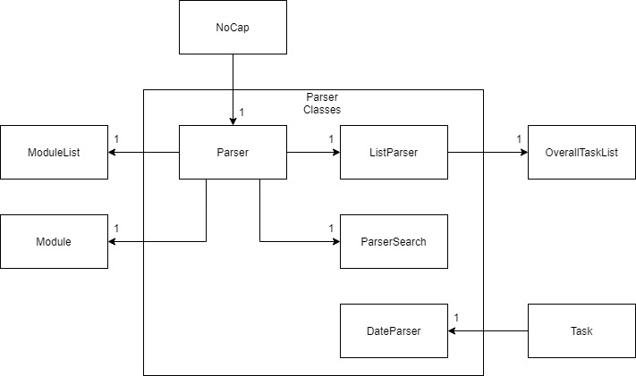

# Developer Guide

## Acknowledgements

{list here sources of all reused/adapted ideas, code, documentation, and third-party libraries -- include links to the original source as well}
 
 
Third party libraries:
- [Jackson Databind](https://mvnrepository.com/artifact/com.fasterxml.jackson.core/jackson-databind)
- [Jackson Datatype-jsr310](https://mvnrepository.com/artifact/com.fasterxml.jackson.datatype/jackson-datatype-jsr310)
- [Jackson Annotations](https://mvnrepository.com/artifact/com.fasterxml.jackson.core/jackson-annotations)

## Design & implementation

{Describe the design and implementation of the product. Use UML diagrams and short code snippets where applicable.}

## Product scope
### Target user profile

{Describe the target user profile}

### Value proposition

{Describe the value proposition: what problem does it solve?}

## User Stories

|Version| As a ... | I want to ... | So that I can ...|
|--------|----------|---------------|------------------|
|v1.0|new user|see usage instructions|refer to them when I forget how to use the application|
|v2.0|user|find a to-do item by name|locate a to-do without having to go through the entire list|

## Non-Functional Requirements

{Give non-functional requirements}

## Glossary

* *glossary item* - Definition

## Instructions for manual testing

{Give instructions on how to do a manual product testing e.g., how to load sample data to be used for testing}

-
# [**Acknowledgements**](https://se-education.org/addressbook-level3/DeveloperGuide.html#acknowledgements)
-
# [**Setting up, getting started**](https://se-education.org/addressbook-level3/DeveloperGuide.html#setting-up-getting-started)
-
# [**Design**](https://se-education.org/addressbook-level3/DeveloperGuide.html#design)

-
# [Architecture](https://se-education.org/addressbook-level3/DeveloperGuide.html#architecture)
-
# [Parser component](https://se-education.org/addressbook-level3/DeveloperGuide.html#ui-component)

**API** : <code>command.parser </code>

The Parser classes is responsible for receiving user input and converting it into commands which are directly passed to respective classes.

The class diagram below is an overview of relationship between Parser classes and other classes.

How the parsing works:
* `NoCap` passes the user input to `Parser` which separates the input into useful information such as taskType, taskDescription, Module, etc. 
* This information is used to call the corresponding commands in `ModuleList`, `Module` , `SemesterList`, `Semester` and `OverallTaskList`.
* When commands include **task selection**, `ParserSearch#getTaskFromIndex()` and `ParserSearch#getTaskFromKeyword()` are called. The corresponding task is returned if found.
* When commands include **listing tasks**, the taskDescription is passed to `ListParser` which determines the method of sorting and calls `OverallTaskList` methods accordingly.
* `DateParser` handles parsing String into LocalDateTime format and displaying LocalDateTime as String. It is utilized by `Task`.

Below is a step by step example of how the parser receives and decipher a user input. In this example, the user enters `list task sortbydate`.   

The Sequence Diagram below illustrates the process

**Note**: The alternate paths are omitted from the diagram for clarity.

Step 1)  
`NoCap` creates a new `Parser` instance through the constructor. The parser class creates a `ListParser`.

Step 2)  
User enters `list task sortbydate`. `NoCap` passes the input to `Parser` through `chooseTask()` method.

Step 3)  
`splitInput` is called for the first time and splits the user input into `list` and `task sortbydate`. `list` matches a possible command String, calling `listParser()`.  

Step 4)  
`splitInput` is called a second time and splits the second part of user input into `task` and `sortbydate`. An instance of `OverallTask` is constructed.  

Step 5)  
`task` and `sortbydate` both matches possible command Strings, calling `sortByDateAndPrint`. 

The diagram below illustrates the `splitString` process.  

# [Storage component](https://se-education.org/addressbook-level3/DeveloperGuide.html#logic-component)
-
# [semester component](https://se-education.org/addressbook-level3/DeveloperGuide.html#model-component)
-
# [module component](https://se-education.org/addressbook-level3/DeveloperGuide.html#storage-component)
-
# [schedule component](https://se-education.org/addressbook-level3/DeveloperGuide.html#common-classes)
-
# [task component]
-
# [**Implementation**](https://se-education.org/addressbook-level3/DeveloperGuide.html#implementation)

# Semester

**API** : `semester`

The Semester component stores all NoCap data i.e., all Semester objects and cummula average point (CAP) (which are contained in a SemesterList object)

* It consists of 2 utility classes SemesterList and Semester
* SemesterList is used to compute and store the cumulative CAP of all semesters and also stores 10 fixed Semester objects
* Each Semester object stores and computes the individual CAP for the semester, while also storing a moduleList of the modules taken during the semester
* The computation of the CAP for both SemesterList and Semester is automatically done when a grade/credit as added to a module within any semester

# Module List

**API** : module

Data from all the modules are stored in the ModuleList class. This includes:

1. moduleName
2. letterGrade
3. credits
4. points
5. TaskList
6. GradableTaskList
7. ScheduleList

The modules are stored in an ArrayList and ModuleList uses the Module.get(int index) method to access the target Module.

- ModuleList is responsible for printing the Time Table. It accesses different schedules of different mods before constructing a Time Table.
- ModuleList contains getter method find(String input) which returns a module by the same name as the input.

How printing a timetable works:

1. ModuleList first extracts day of week and timeslot information from different schedules.
2. It then prints out the Timetable one line at a time. At the same time it checks if the day of week and the timeslot corresponds to the schedule.

- If day of week and timeslot corresponds, venue and comments information is printed out
- If day of week and timeslot does not correspond, and blank character &quot; &quot; is printed instead.

# ScheduleList

**API** : schedule

ScheduleList consists of all data for the schedule for the module.

This includes:

day of week

timeslot

venue

comments

How ScheduleList works:

1. An empty ScheduleList is created when a module is constructed.
2. When addClass is called in module , ScheduleList parses the input from the user and splits the information into the relevant information. The information is then used to generate a new instance of Schedule which is then added to the list.
3. toString() prints out all relevant schedule information in a list format. This is done by going through the list and printing Schedule one after another.

Notes about ScheduleList

- ScheduleList checks that the input for the day of the week is only from the list of possible days: MON, TUE, WED, THU, FRI, SAT ,SUN. All other inputs will result in an exception being thrown.
- When a new Schedule class is called, ScheduleList ensures that the length of venue and comments are less than 16 characters in length. This is to ensure that it fits within its time slot within the Timetable when printed.

# TaskList

**API** : `task.tasklist`

How the `TaskList` component works:

1. `TaskList` stores all tasks in an `ArrayList&lt;Task>`.
2. When the `addTask()` method is called, the `getDate()` and `removeDate()` return the `date` and `description` component of the user input respectively and store it as a local variable of a `String` type.
3. The `String` variables will then be passed to instantialize a new `Task` object.
4. This `Task` object will then be stored in the `ArrayList` in the `TaskList` object.
5. The methods `weeklyTaskList()`, `monthlyTaskList` and `yearlyTaskList()` returns an `ArrayList` which contains the `Task` objects of deadline within a week, a month and a year respectively.
6. The methods `sortTaskListByDate()`  and `sortTaskListByStatus()` will sort the current `TaskList` object by ascending order of `Deadline` and completion status.
7. The `ArrayList` returned by the above methods can then be passed to `printTasks()` which will call `toString()` in each `Task` object and print to the `Output Stream`.

# Task

**API** : `task.task`

`Task` object stores the following for each task:

1. `description`
2. `Date`
3. `isDone`
4. `isLate`
5. `deadline`

How the `Task` component works:

1. Whenever the `Task` object is instantiated, the `attributes` listed above will be initialized by the `setter` methods: `setDescription()`,  `setDate()`,  `setDone()`, `setLate()` and `setDeadline()`.
2. When calling `printAllTask()`, `printWeeklyTask()`, `printMonthlyTask()` in `OverallTaskList` the method  `updateOverdue()`will be called which checks for the truth value of the `boolean` attribute `isDone` and also whether the current date and time of the system clock is after  the `deadline` of the `Task` object.
3. If `isDone` is `FALSE` and the `deadline` is later than the current date and time, `updateOverdue()` will set the attribute `isLate` of the current `Task` object to `TRUE`.
4. Calling the `toString()` method of the` Task` object will call `createLateIcon()` ,` createStatusIcon()` , 