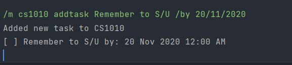
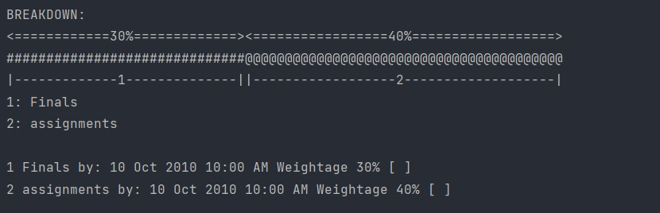
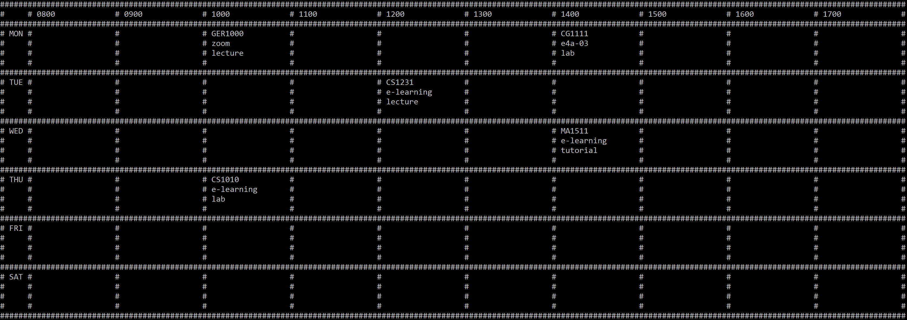

# User Guide

## Introduction

NoCap (NC) is a **desktop app for managing modules taken in NUS, optimized for use via a Command Line Interface** (CLI).
If you can type fast, NC can get your module management tasks done faster than traditional GUI apps. It is the perfect
app for NUS students!

## Quick Start

1. Ensure that you have Java 11 or above installed.
2. Download the latest version of `NoCap` from [here](https://github.com/AY2122S1-CS2113T-F11-1/tp/releases).
3. Move the downloaded NoCap.jar to an empty directory.
4. Navigate to this directory on the Command Prompt.
5. Run NoCap.jar using the command `java -jar NoCap.jar`.

## Features

### **Command format:**

* Words in `<>` are the parameters to be supplied by the user. \
  e.g. `add <module name>` `<module name>` is the name of the module supplied by the user.
* Parameters must be in the exact order as seen in the user guide. \
  e.g. if the command specifies `/m CG1111 addclass MON/0800/E1-03/tutorial`
  , `/m CG1111 addclass 0800/E1-03/tutorial/MON/`
  is not acceptable.
* Commands that require <> parameters must be supplied, if not an error will be thrown. e.g. if the command
  specifies `/m <module> addclass <day/period/location/comments>` , `/m CG1111 addclass MON/0800/E1-03/` is not acceptable.
* Commands that require () parameters are optional. e.g. for `/m <module> list (optional argument)`, `/m cs1010 list` is acceptable.
* All specifier commands are case-sensitive. e.g. `HELP`, `/M CG1111 ADDCLASS MON/0800/E1-03/tutorial` and `ADD CS2113T`
  are invalid commands.

### Viewing help : `help`

Shows a message explaining how to use NoCap.

### Listing semesters : `list semesters`

Lists all preloaded semesters and their corresponding indexes.

Example output:

```
    1 : Y1S1
    2 : Y1S2
    3 : Y2S1
    4 : Y2S2
    5 : Y3S1
    6 : Y3S2
    7 : Y4S1
    8 : Y4S2
    9 : Y5S1
    10 : Y5S2
```

### Switching semesters : `switch <semester index>`

Switches the currently accessed semester to the corresponding input index. (refer to `list semesters` for the index).
The currently accessed semester on start up is your last accessed semester from any previous use.

Examples:

* `Switch 1`
* `Switch 2`

### Adding module: `add <module>`

Adds a module

Examples:

* `add CS2113T`
* `add MA1508`

Note:

* Module code can only contain up to 16 characters

### Delete module: `delete <module index> `

Deletes a module corresponding to the input index. (refer to `list module` for indexes )

Examples:

* `delete 1`
* `delete 2`

Example output:

```
CS2113T has been successfully deleted
Remaining Modules are: 
1
Module name: CS2040C
CREDITS: 4
--------------------------- 
SCHEDULE: 
--------------------------- 
GRADE: A
TASKS: []
BREAKDOWN: 
```

### List module : `list module`

Lists all added modules and their corresponding indexes.

### Add task to module : `/m <module> addtask <description> /by <date> (time)`

* The `date` is in the format of dd/MM/yyyy, dd MM yyyy.
* The `time` is in the format of hhmm.
* The `description` can contain white spaces.

Note:

* If time is omitted, time will default to 0000 hrs.
* If duplicate task exist and has a different deadline, the existing task's deadline will be updated with the new
  deadline.
* If duplicate task has same deadline, new task will be rejected by the program.

Example of usage:

* `/m cs1010 addtask Remember to S/U /by 20/11/2020`

Example of expected output:



**Warning** :

* For every month, the program will take in 01 - 31 as an input for the day of the month.
* In the case when the month does not have 31 days, the program will treat any input after the last day of the month
  until 31 as the last day.

Example:

* Date input as `31/02/2021` will be parsed as `28/02/2021` because there are only 28 days in the month of February.
* Date input as `31/04/2021` will be parsed as `30/04/2021` because there are only 30 days in the month of April

### Add gradable task to module : `/m <module> addgradable <description> /by <date> (time) /w <weightage>`

Adds a Gradable Task to the module.

* Refer to Add Task for deadline format.

Note:

* The weightage needs to be an Integer between 5 - 100.
* The total value of all gradable tasks within the module needs to be less than or equals to 100, else a error message
  will be shown.

Examples:

* `/m CS2113 addgradable Finals /by 10/10/2010 1000 /w 30`
* `/m CS2113 addgradable assignments /by 10/10/2010 1000 /w 40`

Expected output:



Note:

* The suffix of the Gradable Task `[]` shows if the task is completed.
* If it is completed, the suffix will show `[X]`.

### Edit description of task : `/m <module> editdesc <task index> <new description>`

Edit the description of a task at the specified index in the given module.

Note:

* An error message will be shown if the user input a duplicate description of an existing task.

### Edit deadline of task : `/m <module> editdate <task index> <new date>`

Edit the deadline of a task at the specified index in the given module.

### Delete task from module : `/m <module> deletetask <substring>`

Finds and list down tasks with the substring. Type corresponding index to delete the task.

### Marks module task as done : `/m <module> done <task index>`

Mark task as done.

Other similar commands include:  
Mark task as not done: `/m <module> notdone <task index>`  
Mark gradable task as done:`/m <module> gradabledone <task index>`  
Mark gradable task as not done:`/m <module> gradablenotdone <task index>`

### Listing module tasks : `/m <module> list (optional argument)`

Shows a list of task of specified module.

By default, all tasks in the module specified in the current semester are listed, but this can be customised by adding
optional arguments.

(optional argument) includes:

* gradable - Shows a list of gradable tasks in the module.
* sortbydate - Sort tasks by due date, the closest deadline have the higher priority in the list. does not print the
  task list.
* sortbystatus - Sort tasks by status, finished tasks of lower priority. Does not print task list.
* w - list tasks due within the next week.
* m - list tasks due within the next month.
* y - list tasks due within the next year.

Task Prefixes:

* There are 2 prefixes in each Task defined as `[ ]`
* The first prefix is a `LATE` tag. If the task is overdue, the tag will show `[LATE]`
* The second prefix is a `DONE` tag. If the task is marked completed, the tag will show `[X]`
* Format will be as follows `[LATE][DONE] <task description> <date> <time>`

Examples with expected output:

Assuming tasks have been added to modules beforehand:

* `/m cs1010 list`

    ```
    Task List for CS1010: 
  1.[LATE][X] Remember to S/U by: 20 Nov 2020 12:00 AM
  2.[LATE][ ] Remember to drop out by: 12 Dec 2020 11:59 PM
  3.[ ] retake cs1010 by: 12 Dec 2021 11:59 PM
  4.[ ] do assignment by: 30 Oct 2021 04:00 PM
  ```

* `/m cs1010 list gradable`   

  ```
  BREAKDOWN:
    <=================40%==================>
    ########################################
    |------------------1-------------------|
    1: assignments

    1 assignments by: 10 Oct 2010 10:00 AM Weightage 40% [ ]
  ```
* `/m cs1010 list sortbydate`

  ```
  CS1010 successfully sorted by date
  ```

  ```
  /m cs1010 list
  ```

  ```
  Task List for CS1010: 
  1.[LATE][X] Remember to S/U by: 20 Nov 2020 12:00 AM
  2.[LATE][ ] Remember to drop out by: 12 Dec 2020 11:59 PM
  3.[ ] do assignment by: 30 Oct 2021 04:00 PM 
  4.[ ] retake cs1010 by: 12 Dec 2021 11:59 PM
  
  ```


* `/m cs1010 list w`

  ```
  Task List for CS1010: 
  There are 3 tasks due within 7 days 
  1.[LATE][X] Remember to S/U by: 20 Nov 2020 12:00 AM
  2.[LATE][ ] Remember to drop out by: 12 Dec 2020 11:59 PM
  3.[ ] do assignment by: 30 Oct 2021 04:00 PM 
  ```

NOTE:

* For optional arguments `w`, `m` and `y`, overdue tasks are listed together with the weekly/monthly/yearly tasks
  regardless of due date as a reminder that the user has forgotten to do the task.
* `/m <module> list` does not show gradable tasks.
* To show gradable task in module, have to input optional argument as shown above.

### Add class to module : `/m <module> addclass <day/period/location/comments>`

Adds a class to a module

Examples:

* `/m CG1111 addclass MON/0800/E1-03/tutorial`
* `/m MA1508 addclass WED/1000/zoom/lecture`

Note:

* DAY can only take on the following inputs in both uppercase and lowercase: {MON, TUE, WED, THU, FRI, SAT, SUN}
* PERIOD is a 1hr block in 24hr format
* Examples:

<table>
  <tr>
   <td>
Valid
   </td>
   <td>Invalid 
   </td>
  </tr>
  <tr>
   <td>0800
   </td>
   <td>0830
   </td>
  </tr>
  <tr>
   <td>1000
   </td>
   <td>2500
   </td>
  </tr>
  <tr>
   <td>0000
   </td>
   <td>11111
   </td>
  </tr>
</table>

* LOCATION and COMMENTS can only take on a maximum of 16 characters and cannot be empty
* Only one class can be added in any period

### Delete classes from module: `/m <module> deleteclass <class index>`

Deletes a module corresponding to the input index.(refer to `/m <module name> info` or `list module` for indexes)

Examples:

* `/m CS2040C deleteclass 1`
* `/m CG1112 deleteclass 2`

Example output:

```
Class: 
Day: TUE
Start Time: 1000
Location: zoom
Comments: lect
has been successfully deleted

Remaining Classes are: 
1.
Day: MON
Start Time: 1000
Location: zoom
Comments: lect
```

### Add credit to module: `/m <module> addcredit <credit value>`

Add credits to a module.

Examples:

* `/m CS2113 addcredit 4`
* `/m MA1511 addcredit 2`

Example output:

```
Module credits successfully added:
Module name: CS2040C
CREDITS: 4
--------------------------- 
SCHEDULE:
--------------------------- 
GRADE: A
TASKS: []
BREAKDOWN:
```

Note:

* Credit values must be positive integers

### Add grade to module: `/m <module> addgrade <grade letter>`

Adds a grade to a module

Examples:

* `/m CS2113 addgrade A`
* `/m MA1508 addgrade B-`

Example output:

    /m cs2040c addgrade A
    Module grade successfully added: 
    Module name: CS2040C
    CREDITS: 4
    --------------------------- 
    SCHEDULE: 
    --------------------------- 
    GRADE: A
    TASKS: []
    BREAKDOWN:

Note:

* A grade can be added to a module only after credit is assigned to the module.

Note:

* The input for `<grade>` is case-sensitive.
* The input for `<grade>` must correspond to one of the following values:
    1. A+
    2. A
    3. A-
    4. B+
    5. B
    6. B-
    7. C+
    8. C
    9. D+
    10. D
    11. F

### Delete grade from module: `/m <module> deletegrade`

Deletes the grade, if any.

Examples:

* `/m CS2113 deletegrade`
* `/m MA1511 deletegrade`

Example output:

    Module grade has been successfully deleted
    Module name: CS1010
    CREDITS: 0
    --------------------------- 
    SCHEDULE: 
    --------------------------- 
    GRADE: null
    TASKS: []
    BREAKDOWN:

### View Timetable : `timetable `

Shows the timetable for the currently accessed semester.

Example output:


Note:

* Timetable can only display classes from 0800 to 1700 periods
* If timetable shows artifacts (i.e. columns not aligned/information displayed incorrectly):
  * Restart NoCap in a maximized command prompt window
  * Reduce text size in your computer settings

### Listing all tasks : `list task (optional argument)`

Shows a list of all tasks within the current semester

By default, all tasks in the current semester are listed, but this can be customised by adding optional arguments.

(optional argument) includes:

* sortbydate - Sort tasks by due date.
* sortbystatus - Sort tasks by status, displaying unfinished tasks first.
* gradable - list gradable tasks only.
* normal - list non-gradable tasks only.
* w - list tasks due within the next week.
* m - list tasks due within the next month.
* y - list tasks due within the next year.

Tasks are listed in the format:

`[Module Code][Gradable][Lateness][Done] <description> by: <deadline> [Weightage]`

* [Module Name] - Name of the module
* [Gradable] - Shows `[G]` if the task is gradable, and `[ ]` if the task is non-gradable.
* [Lateness] - Shows `[LATE]` if the task is overdue. Only shows up for overdue tasks
* [Done] - Shows `[X]` if the task is done, and `[ ]` if the task isn’t done yet.
* &lt;description> - Description of the task
* &lt;deadline> - Deadline of the task
* [Weightage] - Weightage of the task, if it is gradable. Only shows up for gradable tasks.

Example tasks:

1. `[CS2132][G][ ] Assignment by: 16 Dec 2021 12:00 AM [Weightage: 50%]`

    * Belongs to the module CS2132
    * Gradable
    * Not done yet
    * Due on 16 Dec 2021 12:00 AM
    * Has a weightage of 50%.

2. `[CS2132][ ][X] Quiz by: 16 Nov 2021 12:00 AM`

    * Belongs to the module CS2132
    * Non-Gradable
    * Done
    * Due on 16 Nov 2021 12:00 AM

Example commands with expected output:

Assuming tasks have been added to modules beforehand:

* `list task`

    ```
    All tasks: 
    1. [CS2132][G][ ] Assignment by: 16 Dec 2021 12:00 AM [Weightage: 50%]
    2. [CS2132][G][LATE][ ] asdf by: 10 Dec 2000 12:00 AM [Weightage: 50%]
    ```


* `list task sortbydate`

  ```
  Tasks sorted by date: 
  1. [CS2132][G][LATE][ ] asdf by: 10 Dec 2000 12:00 AM [Weightage: 50%]
  2. [CS2132][G][ ] Assignment by: 16 Dec 2021 12:00 AM [Weightage: 50%]
  ```


* `list task w`

  ```
  Weekly tasks: 
  1. [CS2132][G][LATE][ ] asdf by: 10 Dec 2000 12:00 AM [Weightage: 50%]
  ```

NOTE:

* For optional arguments `w`, `m` and `y`, overdue tasks are listed together with the weekly/monthly/yearly tasks
  regardless of due date as a reminder that the user has forgotten to do the task.

### View CAP : `cap`

Shows the CAP for the currently accessed semester.

Example output:

* `This semester's CAP: 4.25`

NOTE:

* Modules with a credit value of 0 will not be calculated towards overall CAP.

### View all CAP : `allcap`

Shows the CAP for all semesters and aggregated CAP.

Format: `allcap`

Example output:

    Cumulative CAP: 4.25
    Y1S1: 4.25
    Y1S2: 0.0
    Y2S1: 0.0
    Y2S2: 0.0
    Y3S1: 0.0
    Y3S2: 0.0
    Y4S1: 0.0
    Y4S2: 0.0
    Y5S1: 0.0
    Y5S2: 0.0

### Exiting the program : `bye`

Exits the program.

### Saving data

Program data is saved whenever data is added or modified. The process is done automatically, so no user input is needed
for this.

### Loading data

Program data is loaded from the data folder during startup of the program. If the program can detect the data file
successfully, the data is loaded and the following message should appear:

```
Data loaded successfully
Welcome to NoCap
```

On the other hand, if no data file can be found, the program starts with an empty template, and the following message
should appear:

```
No save file found, starting with an empty template
Welcome to NoCap
```

## FAQ

**Q**: How do I transfer my data to another computer?

**A**: Simply transfer your data.json file to the data subfolder of another NoCap application.

> **WARNING**: Replacing data.json file in another NoCap folder results in the  existing data being erased!

## Command Summary

|Action|Format|
|--------|----------|
|show help| help |
|Show all semesters| list semesters|
|Change semester| switch \<semester index>|
|Add module| add \<module name>|
|Delete module| delete \<module index>|
|List all module| list module|
|Add task| /m \<module> addtask \<description> /by \<date> (time)|
|Add gradable task | /m \<module> addgradable \<description> /by \<date> (time) /w \<weightage>|
|Edit description| /m \<module> editdesc \<task index> \<new description>|
|Edit deadline| /m \<module> editdate \<task index> \<new deadline>|
|Delete task| /m \<module> deletetask \<substring>|
|Mark task as complete| /m \<module> done \<task index>|
|Mark task as incomplete| /m \<module> notdone \<task index>|
|Mark gradable task as complete| /m \<module> gradabledone \<task index>|
|Mark gradable task as incomplete| /m \<module> gradablenotdone \<task index>|
|List module tasks| /m \<module> list (optional argument)|
|Add class | /m \<module> addclass \<day/period/location/comments>|
|Delete class| /m \<module> deleteclass \<class index>|
|Add grade| /m \<module> addgrade \<grade letter>|
|Delete grade| /m \<module> deletegrade|
|Add credit| /m \<module> addcredit <credit value>|
|Show timetable| timetable|
|List all tasks| list task (optional argument)|
|Show semester cap| cap|
|Show overall cap| allcap|
|Exit NoCap|bye|
