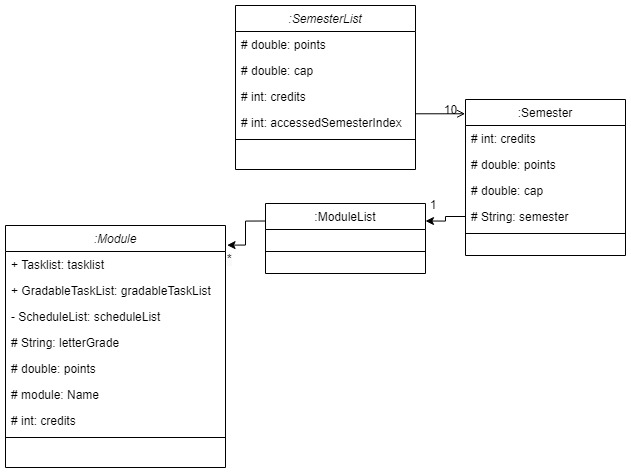
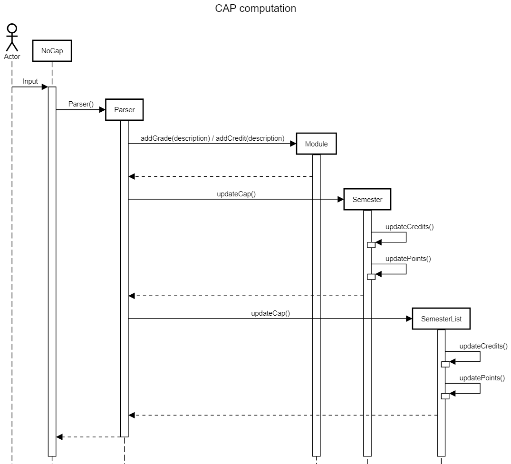

# Yap Joon Siong - Project Portfolio Page

## Overview
NoCap (NC) is a **desktop app for managing modules taken in NUS, optimized for use via a Command Line Interface** (CLI).
If you can type fast, NC can get your module management tasks done faster than traditional GUI apps. It is the perfect
app for NUS students!

### Summary of Contributions
* **Code contributed:** [Reposense Link](https://nus-cs2113-ay2122s1.github.io/tp-dashboard/?search=&sort=groupTitle&sortWithin=title&timeframe=commit&mergegroup=&groupSelect=groupByRepos&breakdown=true&checkedFileTypes=docs~functional-code~test-code~other&since=2021-09-25&tabOpen=true&tabType=authorship&tabAuthor=yapjoonsiong&tabRepo=AY2122S1-CS2113T-F11-1%2Ftp%5Bmaster%5D&authorshipIsMergeGroup=false&authorshipFileTypes=docs~functional-code~test-code&authorshipIsBinaryFileTypeChecked=false&zFR=false)
* **Enhancements Implemented** :
    * `semester` package
        * Consists of utility classes `SemesterList` and `Semester`, where `SemesterList` computes and stores the 
          cumulative CAP of all semesters and also stores 10 `Semester` objects, and `Semester` stores and computes the 
          individual CAP for the semester, while also storing a ModuleList of the Module objects taken during the semester
        * Integrated and modified dependencies (`ModuleList` and `Module`) as the project went on
        * Implemented core functionalities such as `cap` and `allcap`
    * `schedule` package
        * Consists of utility classes `ScheduleList` and `Schedule`, where `ScheduleList` stores all `Schedule` objects,
          and `Schedule` stores all information for any schedule added to `Module`
        * Integrated and modified dependencies (namely `Module`) as the project went on
    * `ModuleList` and `Module` classes
        * Integrated classes and implemented core functionalities such as `timetable` and backend methods to calculate
          `cap` and `allcap`
        * Implemented core backend method to find modules by name
* **Contributions to the UG** :
    * Features: List Semesters
    * Features: Switching Semesters
    * Features: Adding a class
    * Features: Deleting a class
    * Features: Add credits to a module
    * Features: View CAP
    * Features: View all CAP
* **Contributions to the DG** :
    * Acknowledgements
    * Design and implementation: semester
    * Appendix C: Non Functional Requirements
* **Contributions to team-based tasks** :
    * Managing collaborative google drive folder
    * Setting up conference group to facilitate meetings
* **Review/Mentoring Contributions**
    * Help teammates when faced with technical issues by meeting up and helping to debug functional problems.
    * Integrated most core functional classes together at the start of the project to release a Minimum Viable Product

###Developer Guide Extract
## Semester

**API** : `semester`



The `Semester` component stores all NoCap data i.e., all `Semester` objects and their components and cumulative average
point (CAP) (which are contained in a SemesterList object)

* It consists of 2 utility classes `SemesterList` and `Semester`
* `SemesterList` is used to compute and store the cumulative CAP of all semesters and also stores 10 `Semester` objects
* Each `Semester` object stores and computes the individual CAP for the semester, while also storing a `ModuleList` of
  the `Module` objects taken during the semester
* The computation of the CAP for both `SemesterList` and `Semester` is automatically done when a grade/credit as added
  to a `Module` object within any semester

This is how CAP is computed:



* When `commandAddGrade()` or `commandAddCredit()` is called in Parser, `addGrade(description)`
  or `addCredit(description)` respectively are called in `Module`, setting the module’s `grade`, `points` and `credits`
  to their corresponding values.
* Then, `updateCap()` is called in `Semester` with the newly set `grade`/`credits` values in `Module`, followed
  by `updateCap()` in `SemesterList` with the newly set `points`/`credits` values in `Semester`.

# Appendix C: Non Functional Requirements
1. Should work on any mainstream OS as long as it has Java 11 or above installed.
2. A user with above average typing speed for regular English text (i.e. not code, not system admin commands) should be able to accomplish most of the tasks faster using commands than using the mouse.

###User Guide Extract

### Listing semesters : `list semesters`
Lists all preloaded semesters and their corresponding indexes

Example output:

```
    1 : Y1S1
    2 : Y1S2
    3 : Y2S1
    4 : Y2S2
    5 : Y3S1
    6 : Y3S2
    7 : Y4S1
    8 : Y4S2
    9 : Y5S1
    10 : Y5S2
```

### Switching semesters : `switch <semester index>`

Switches the currently accessed semester to the corresponding input index. (refer to `list semesters` for the index).
The currently accessed semester on start up is your last accessed semester from any previous use.

Examples:

* `Switch 1`
* `Switch 2`

### Add class to module : `/m <module> addclass <day/period/location/comments>`

Adds a class to a module

Examples:

* `/m CG1111 addclass MON/0800/E1-03/tutorial`
* `/m MA1508 addclass WED/1000/zoom/lecture`

Note:

* DAY can only take on the following inputs in both uppercase and lowercase: {MON, TUE, WED, THU, FRI, SAT, SUN}
* PERIOD is a 1hr block in 24hr format
* Examples:

<table>
  <tr>
   <td>
Valid
   </td>
   <td>Invalid 
   </td>
  </tr>
  <tr>
   <td>0800
   </td>
   <td>0830
   </td>
  </tr>
  <tr>
   <td>1000
   </td>
   <td>2500
   </td>
  </tr>
  <tr>
   <td>0000
   </td>
   <td>11111
   </td>
  </tr>
</table>

* LOCATION and COMMENTS can only take on a maximum of 16 characters and cannot be empty
* Only one class can be added in any period

### Delete classes from module: `/m <module> deleteclass <class index>`

Deletes a module corresponding to the input index.(refer to `/m <module name> info` or `list module` for indexes )

Examples:

* `/m CS2040C deleteclass 1`
* `/m CG1112 deleteclass 2`

Example output:

```
Class: 
Day: TUE
Start Time: 1000
Location: zoom
Comments: lect
has been successfully deleted

Remaining Classes are: 
1.
Day: MON
Start Time: 1000
Location: zoom
Comments: lect
```

### Add credit to module: `/m <module> addcredit `

Add credits to a module.

Examples:
* `/m CS2113 addcredit 4`
* `/m MA1511 addcredit 2`

Example output:
```
Module credits successfully added:
Module name: CS2040C
CREDITS: 4
--------------------------- 
SCHEDULE:
--------------------------- 
GRADE: A
TASKS: []
BREAKDOWN:
```

Note:
* Credit values must be positive integers

### View CAP : `cap`

Shows the CAP for the currently accessed semester.

Example output:

* `This semester's CAP: 4.25`

NOTE: Modules with a credit value of 0 will not be calculated towards overall CAP.

### View all CAP : `allcap`

Shows the CAP for all semesters and aggregated CAP.

Format: `allcap`

Example output:

    Cumulative CAP: 4.25
    Y1S1: 4.25
    Y1S2: 0.0
    Y2S1: 0.0
    Y2S2: 0.0
    Y3S1: 0.0
    Y3S2: 0.0
    Y4S1: 0.0
    Y4S2: 0.0
    Y5S1: 0.0
    Y5S2: 0.0